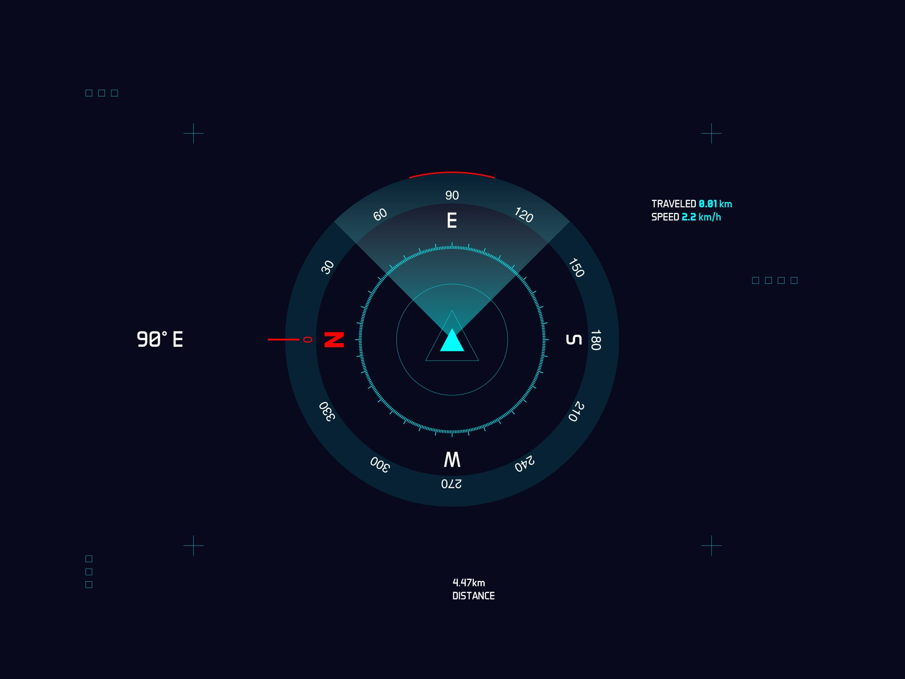

# Requires Python Version >3.9

Ziel ist das anlegen einer Know How Transfer Webseite.
Eine interaktive Webanwendung, die die Matrixtransformationen visualisiert.

plotly.com/javascript/3d-point-clustering

WGS48 Koordinaten

Welche Transformationen sind nötig, wie ist der Fluss im Gesamtsystem?

Ungefähr so soll der Kompass aussehen:

